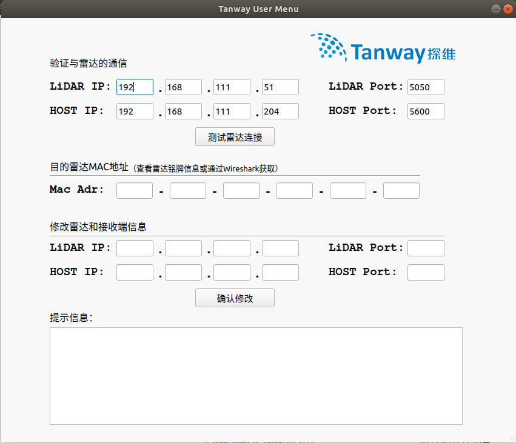
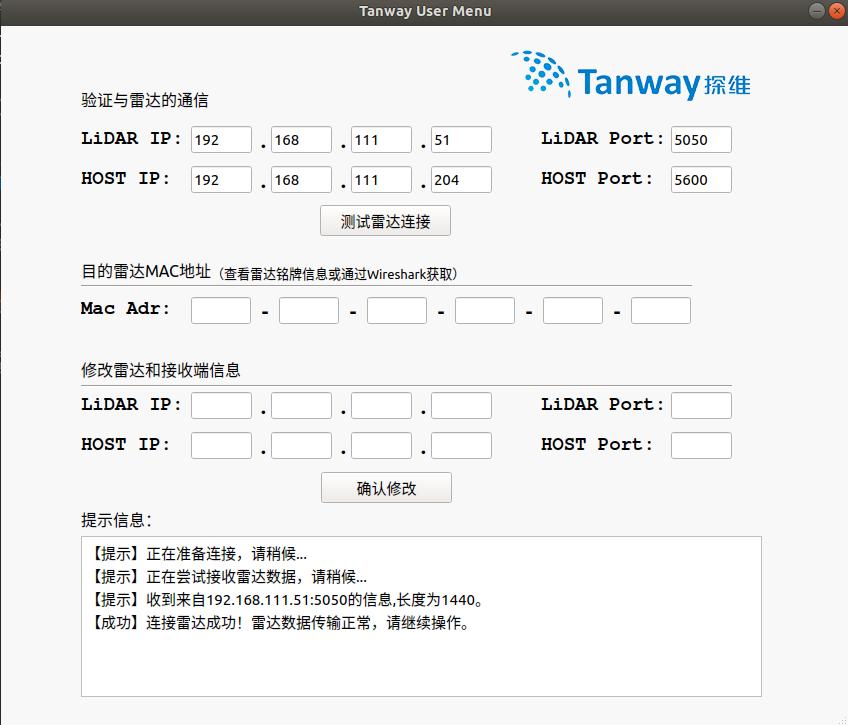
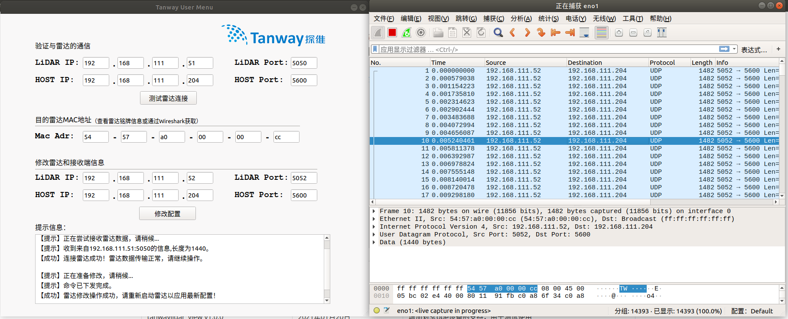

# tanwaylidar_view[v3.0.10]
tanwaylidar_view 是探维科技针对所产雷达系列产品的上位机软件，在Ubuntu18.04环境下开发测试通过。

软件需在ROS环境下使用，ROS安装参见[安装教程](http://wiki.ros.org/ROS/Installation "")。

# 概览

[软件下载与编译](#软件下载与编译)

[点云显示软件使用](#点云显示软件使用)

[IP修改工具使用](#IP修改工具使用)


# 软件下载与编译

1. 打开终端（快捷键：ctrl+alt+T）

1. 创建ROS工作空间

```bash
mkdir -p ~/tanwaylidar_driver/src
cd ~/tanwaylidar_driver/src
```

3. 下载代码

注意: 如需获取特定版本，请联系探维公司技术支持。

```bash
git clone https://github.com/TanwayLab/tanwaylidar_view.git
cd tanwaylidar_view/sdk
git submodule init
git submodule update
```

输入用户名密码，下载成功后，\~/tanwaylidar_driver/src文件夹下就会出现程序包。此步骤也可直接在github的项目下直接下载程序的zip压缩包，然后解压到\~/tanwaylidar_driver/src文件夹下。

4. 编译程序

```
cd ~/tanwaylidar_driver && catkin_make
```

5. 配置.launch文件（雷达连接参数）

   在路径~/tanwaylidar_driver/src/tanwaylidar_view/launch/下找到对应设备型号的.launch文件进行如下修改：

   - 实时连接参数配置示例（即直接连接雷达使用，以Duetto设备型号为例）

     ```xml
     	<!--连接模式:仅支持"on-line"、"off-line"两种模式配置-->
     	<param name="ConnectType" type="string" value="on-line" />
     
     	<!--实时模式下配置-->
     	<!--本机IP地址-->
     	<param name="LocalHost" type="string" value="192.168.111.204" />
     
     	<!--雷达设备的IP地址-->
     	<param name="LidarHost" type="string" value="192.168.111.51" />
     	<!--雷达发送点云数据的目的端口（即设备接收点云数据的端口）-->
     	<param name="LocalPointloudPort" type="int" value="5600" />
     	<!--雷达发送DIF数据的目的端口（即设备接收DIF数据的端口）-->
     	<param name="LocalDIFPort" type="int" value="5700" />
     ```

   - 回放雷达数据参数配置示例（仅支持读取pcap文件，以Duetto设备型号为例）

     ```xml
     	<!--连接模式:仅支持"on-line"、"off-line"两种模式配置-->
     	<param name="ConnectType" type="string" value="off-line" />
     
     	<!--回放模式下配置-->
     	<!--PCAP文件绝对路径-->
     	<param name="PcapFilePath" type="string" value="/home/tanway/lidar_data/duetto.pcap" />
     
     	<!--雷达设备的IP地址-->
     	<param name="LidarHost" type="string" value="192.168.111.51" />
     	<!--雷达发送点云数据的目的端口（即设备接收点云数据的端口）-->
     	<param name="LocalPointloudPort" type="int" value="5600" />
     	<!--雷达发送DIF数据的目的端口（即设备接收DIF数据的端口）-->
     	<param name="LocalDIFPort" type="int" value="5700" />
     ```

6. 设置环境变量

   ```bash
   echo "source ~/tanwaylidar_driver/devel/setup.bash" >> ~/.bashrc
   source ~/.bashrc
   ```

# 点云显示软件使用

1. 修改电脑IP为与雷达通信的IP，默认为"192.168.111.204"

1. 运行程序，正常查看点云 

```bash
【以TensorPro设备为例】roslaunch tanwaylidar_view TensorPro.launch
【以Scope设备为例】roslaunch tanwaylidar_view Scope.launch
【以TSP03-32设备为例】roslaunch tanwaylidar_view TSP03-32.launch
【以Scope-192设备为例】roslaunch tanwaylidar_view Scope-192.launch
【以ScopeMiniA2-192设备为例】roslaunch tanwaylidar_view ScopeMiniA2-192.launch
【以Duetto设备为例】roslaunch tanwaylidar_view Duetto.launch
```


# IP修改工具使用(仅支持TensorPro)

```bash
rosrun tanwaylidar_view tensorpro_interfaces
```

弹出用户交互界面如下,



### 参数说明
输入Mac地址、IP地址和端口信息应符合以下规则，否则将会出错。

- IP地址范围为0.0.0.0至255.255.255.255

- 端口的范围为0至65535,建议端口号设置为大于1024的值

- Mac地址范围为00-00-00-00-00-00至FF-FF-FF-FF-FF-FF

- 上位机与激光雷达IP地址应处于同一网段内

- 激光雷达设备出厂时，默认IP和端口号设计如下：

    激光雷达IP：192.168.111.51，激光雷达端口号：5050

    上位机IP：192.168.111.204，上位机端口号：5600

### 验证连接

- 激光雷达供电工作，利用网线将上位机与激光雷达连接，并将上位机IP地址设置为激光雷达数据发送的目的地址。

- 在“验证与雷达的通信”区域输入IP和端口信息（默认值为雷达出厂网络参数），点击“测试雷达连接”。当连接正常且信息输入正确时，会出现如下图所示的状态栏显示，提示源数据来源和数据长度。



### 修改网络参数

- 激光雷达供电工作，利用网线将上位机与激光雷达连接，并将上位机IP地址设置为激光雷达数据发送的原目的地址。

- 在“验证与雷达的通信”区域输入上位机IP和端口信息，此IP需与上位机IP一致，否则无法发送修改指令。

- 在“修改雷达和接受端信息”区域填写激光雷达的设备Mac信息（一般可从雷达机身的铭牌信息后获得或使用Wireshark抓包工具获取）、新设IP地址和端口信息，点击“确认修改”（因不同操作系统存在权限差异，可能会自动弹出终端要求用户输入密码获取权限，请及时输入用户密码以确保操作成功进行）。

- 当连接正常且信息输入正确时，会出现如下图所示的状态栏显示，提示"【成功】雷达修改操作成功，请重新启动雷达以应用最新配置！"。

- 断开激光雷达电源，重新供电后新配置生效。

- 使用本软件的验证功能或Wireshark等网络调试助手，确认激光雷达IP信息修改生效。


